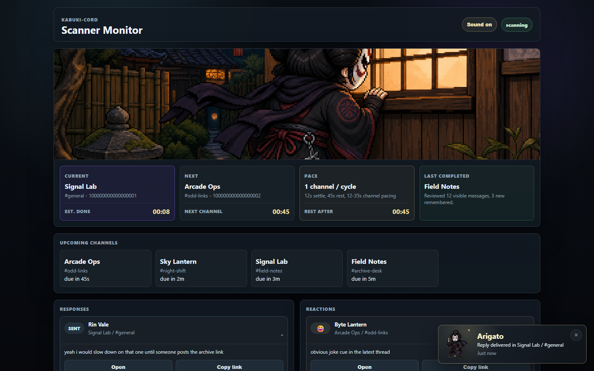

# Kabuki-Cord

Local Discord browser automation and character orchestration app.

Version 2 keeps the browser-based transport by design. It does **not** use Discord's supported bot/gateway integration. Personal-account browser automation is inherently less reliable and carries more platform/account risk than an official integration; use it only with that tradeoff understood.

The V2 runtime is intentionally conservative:

- Uses a persistent browser profile under `%LOCALAPPDATA%\Kabuki-Cord\profiles\discord`.
- Starts in **Observe only** mode by default.
- Keeps browser automation separate from conversation memory and topic tracking.
- Supports a default character card plus per-server overrides.
- Stores Discord and OpenAI credentials in the operating system keyring.
- Stores transactional runtime state in SQLite under `%LOCALAPPDATA%\Kabuki-Cord\state`, with readable JSON recovery mirrors.
- Exposes a desktop app launcher while keeping the backend local to `127.0.0.1`.

## Screenshots

Generic fictional sample data is shown here; real server names, channels, users, approvals, and icons stay in ignored local state.

Dashboard view with fictional server, channel, character, and observed-conversation data:


Approval queue and focused review window with fictional context and draft text:


Scanner monitor with fictional scanner status, upcoming channels, recent responses, and reaction actions:



## Setup

For operating concepts, required inputs, safety modes, and troubleshooting, read the [Operator Guide](docs/OPERATOR_GUIDE.md).

### Simple Windows Install

For normal use, download the Windows release ZIP, extract it somewhere you plan to keep it, then double-click:

```text
Install-Kabuki-Cord.exe
```

If Windows blocks the EXE or you downloaded the source ZIP instead, double-click:

```text
Install-Kabuki-Cord.cmd
```

The installer handles:

- Python 3.11+ detection, with `winget` install fallback when available.
- Virtual environment creation under `.venv/`.
- Python dependency installation.
- Playwright browser support installation.
- Per-user app-data initialization under `%LOCALAPPDATA%\Kabuki-Cord`.
- Desktop and Start Menu shortcuts.
- First app launch after setup.

After install, launch from the **Kabuki-Cord** desktop shortcut or:

```text
Run-Kabuki-Cord.cmd
```

### Manual Dev Setup

```powershell
python -m venv .venv
.\.venv\Scripts\python -m pip install -e .
.\.venv\Scripts\python -m playwright install chromium
```

The app copies its placeholder server/channel config and default character card into `%LOCALAPPDATA%\Kabuki-Cord` on first run. Settings saved in the GUI go to `settings.env` there; secrets do not.

For an isolated development fixture, set:

```text
KABUKI_CORD_DATA_DIR=C:\path\to\temporary\kabuki-data
```

## First Run

```powershell
.\.venv\Scripts\nhi-zues
```

The desktop control panel is the preferred entrypoint:

```powershell
.\.venv\Scripts\kabuki-cord-desktop
```

The app starts a local backend and opens its own window. Use **API & Runtime -> Discord Session** to save Discord credentials locally or open the Discord sign-in window. Future runs reuse the persistent browser profile.

Use **Switch Account** before signing into a different Discord account. Kabuki-Cord pauses the scanner, removes only its app-owned Discord browser session and saved Discord credentials, and disables the previous account's channel automation. Local conversation/activity history is preserved. After the new login completes, use **Sync Discord** and explicitly re-enable the intended channels.

Use **Sign In & Run** when Discord forces a password reset, human check, 2FA, or similar account flow before the profile can be reused. Kabuki-Cord opens the same persistent automation profile visibly, waits while you complete Discord's flow manually, then continues the scanner in that same live browser session. This avoids the fragile close-and-reopen cycle that can lose the freshly authenticated state.

Enable **Silent automation** in **API & Runtime -> Discord Session** to run scanner, sync, and approved delivery in an off-screen Playwright browser. Manual **Sign In** and **Open** channel actions still launch visible Discord windows because those flows require direct operator interaction. **Sign In & Run** starts visible for manual authentication and moves that same session off-screen after login if Silent automation is enabled. If Discord logs the persistent profile out, complete **Sign In & Run** once and routine automation can return to off-screen mode.

Use **Account safety pacing** in **API & Runtime -> Discord Session** to reduce browser churn. The conservative defaults check one channel per scanner cycle in the global round-robin order, keep the channel open briefly before reading, rest between cycles, and only add between-channel waits if you explicitly allow multiple channels per cycle. If Discord asks for a password reset, human verification, 2FA, phone/email verification, or another account security action, Kabuki-Cord stops the operation and records an event instead of repeatedly retrying.

After signing in, click **Sync Discord** in the top bar to read the Discord server rail and available text/forum channels from that persistent browser profile. Discovered servers and channels are merged into your ignored local server config, while newly discovered channels stay inactive until you enable Observe or Engage. The public sample `config/servers.json` stays as a placeholder for GitHub.

Synced server icons are cached under ignored runtime state and displayed in the left rail when Discord exposes an icon URL.

Use **Monitor** in the top bar to open a separate scanner-status window. It shows the current server/channel, next target, upcoming loop order, full-loop countdown, loop counter, and the last completed scan. The server rail also shows red reply dots when local memory detects unresponded mentions or tight replies after the character's latest message; review them in the **Replies** tab.

**Observe only** prints observations and draft decisions without sending messages. Keep that response mode selected while testing selectors, memory, and topic behavior.

For a clean test pass that exits after one sweep:

```powershell
.\.venv\Scripts\kabuki-cord --once
```

To inspect recorded API spend:

```powershell
.\.venv\Scripts\kabuki-cord --usage
```

The browser-based GUI fallback is still available:

```powershell
.\.venv\Scripts\kabuki-cord-gui
```

Then open:

```text
http://127.0.0.1:8765
```

To inspect proactive drafts waiting for approval:

```powershell
.\.venv\Scripts\kabuki-cord --approvals
```

Kabuki-Cord keeps only the five newest pending approval drafts. When semi-auto has been running unattended, older queued drafts are pruned so outdated responses do not pile up waiting for review. Discarding an approval, or using Clear All, also records the source Discord message IDs in local discard state so the scanner does not bring the same stale draft back on the next loop.

To add persistent character continuity without editing the base card:

```powershell
.\.venv\Scripts\kabuki-cord --remember-story "The character previously mentioned enjoying late-night radio."
.\.venv\Scripts\kabuki-cord --remember-behavior "Keep replies to this topic brief and ask one concrete follow-up."
.\.venv\Scripts\kabuki-cord --remember-user "discord:example-user-id" "Avoid repeating the same opening question to this user."
```

API drafting is off by default. To test paid drafting in dry-run mode, set:

```text
OPENAI_API_KEY=...
NHI_ZUES_LLM_ENABLED=true
NHI_ZUES_DRAFT_IN_DRY_RUN=true
NHI_ZUES_MAX_DAILY_USD=0.25
NHI_ZUES_MAX_SESSION_USD=0.05
NHI_ZUES_MAX_LLM_CALLS_PER_RUN=3
```

The **API & Runtime** tab has a **Models** button next to the model field. It calls OpenAI's model-list endpoint with the locally saved key and fills model suggestions for that project. If no key is saved yet, the app shows fallback suggestions and still lets you type a model ID manually.

The routing path is deliberately conservative: new messages are read first, local topic/name triggers decide whether a draft is worth generating, then budget checks run before any API request. Drafts generated during dry-run are logged but not sent.

Per-channel auto-respond can be enabled from the Behavior tab, but it is off by default. When Auto is off, generated replies are queued for approval even if they came from a direct name/alias cue. Dry-run still prevents sending even if auto-respond is enabled.

Autonomous sends also pass a channel safety guard before Discord delivery. By default, Kabuki-Cord blocks unreviewed auto replies if the channel was already sent to in the last 15 minutes, if 3 auto replies were already sent in the last hour, or if the last visible message is still from the character. These settings live under **Account safety pacing** as `NHI_ZUES_REPLY_COOLDOWN_SECONDS`, `NHI_ZUES_REPLY_WINDOW_SECONDS`, `NHI_ZUES_REPLY_MAX_PER_WINDOW`, and `NHI_ZUES_REPLY_REQUIRE_INTERVENING_USER`. Guard blocks are recorded as `reply_guard_blocked` events.

Per-channel React can run independently of Engage. When Observe and React are enabled for a channel and dry-run is off, Kabuki-Cord can add capped lightweight reactions to clear cues such as jokes, agreement, thanks, questions, serious/weird claims, or neutral acknowledgements. The default cap is `NHI_ZUES_REACTION_MAX_PER_CHANNEL=3` per channel scan, and the reaction ledger prevents repeating any app-made reaction on the same Discord message. The **Reaction threshold**, **Random reaction percent**, **Force recent reaction**, and **Reaction emoji override** settings let you make reaction behavior stricter, looser, partially random, apply a rolling reaction percentage to the latest five non-character messages, or fixed to a specific emoji. **Force recent reaction** is a rolling target with a hard cap, not an endless dice roll: if the setting is `20%`, Kabuki will try to keep up to 1 of the latest 5 non-character messages reacted, spending available per-scan reaction cap until the window reaches target. The forced path still chooses the emoji from the message tone; it does not blindly laugh-react unless the message reads like a joke.

The top-bar **Start/Pause** control runs or pauses the local scanner loop. **Observe only** means the scanner can observe, remember, and draft, but approved messages are blocked until the response mode changes in **API & Runtime**.

Scanner pacing is intentionally conservative. The scanner now uses one global round-robin loop across every Observe-enabled channel instead of per-server scan cadences. `NHI_ZUES_SCANNER_MAX_CHANNELS_PER_CYCLE=1` checks one observed channel per cycle, `NHI_ZUES_SCANNER_CYCLE_SLEEP_SECONDS` controls how long the runtime rests after each cycle, and `NHI_ZUES_SCANNER_MIN_CHANNEL_DELAY_SECONDS` / `NHI_ZUES_SCANNER_MAX_CHANNEL_DELAY_SECONDS` control the extra wait only when more than one channel is allowed per cycle. Each normal channel visit refreshes a bounded slice of channel history into local memory so the History tab stays current; `NHI_ZUES_SCANNER_HISTORY_BACKFILL_LIMIT=80` controls how many history rows are kept fresh per visit, `NHI_ZUES_SCANNER_HISTORY_SCROLL_ROUNDS=8` controls scroll depth, and setting the limit to `0` disables scan-time backfill. The Monitor shows the estimated full-loop countdown and loop counter, so adding or removing observed channels automatically changes the loop estimate.

Short, ambiguous messages are retained as local reply candidates instead of being discarded after one scan. A newer message in the same channel causes the bounded candidate window to be scored again, while unchanged deferred windows do not repeatedly invoke the model. `NHI_ZUES_REPLY_CANDIDATE_TTL_SECONDS=600` controls how long this context can accumulate; setting it to `0` restores one-scan decisions. Candidate state contains message IDs and lifecycle metadata only and remains in the local state directory. A cross-process lock permits only one scanner runtime per local state directory, preventing two app windows from evaluating or sending the same candidate concurrently.

The right-side **Events** view shows the live activity trail: routine channel checks, queued approvals, delivery-started status, regenerated drafts, approved sends, autonomous sends, dry-run drafts, and send failures. The GUI auto-refreshes while you are not editing a form and raises an in-app toast for important new events. The Approvals panel intentionally shows the newest five pending drafts only.

Successful sends are recorded transactionally in `%LOCALAPPDATA%\Kabuki-Cord\state\state.db`, with readable JSON mirrors such as `sent_replies.json`. Before queuing or sending another response, Kabuki-Cord checks that ledger against the source Discord message IDs so stale approvals or repeated scans do not double-reply to the same message.

The **Behavior** tab includes writing-imperfection controls. `NHI_ZUES_WRITING_MISTAKE_RATE` sets typo intensity, `NHI_ZUES_WRITING_QUIRK` controls the consistent style quirk, and `NHI_ZUES_WRITING_MISSPELLINGS` stores repeatable replacements such as `definitely:definately`.

Approved live sends can also be human-paced. `NHI_ZUES_TYPING_INDICATOR_ENABLED=true` makes Kabuki-Cord type the final approved message into Discord over a bounded duration so Discord has time to show the normal typing indicator. The min/max duration and characters-per-second controls live in the **Behavior** tab.

## Privacy Boundary

By default, Kabuki-Cord does not send Discord conversation text to OpenAI because LLM drafting is disabled. When you enable LLM drafting, the prompt can include recent visible Discord messages, lightweight per-user memory summaries, character memory, and per-user behavior notes so the model can draft context-aware replies. Use channel-level observe/engage toggles and budget limits to control that exposure.

## Updates

The GUI includes an update check under **API & Runtime**. It only updates from the configured `origin` remote when that remote points at `Algo-Papi/Kabuki-Cord`, and it refuses to pull if the working tree has local changes.

## Approvals

Approval cards can be edited before sending. Source context is collapsed by default so the queue stays readable. Use **Review** to open the focused review window with the full source context, target message, recent-poster chips, draft editor, regeneration note, and send controls. Use **Save** to persist draft edits, **Reply to** chips to target a recent poster and prefix their display name, **Regenerate** to rewrite the draft using your mini prompt, **Discard** to remove an unwanted draft, and **Approve & Send** to send only when dry-run is off.

If Discord shows a human verification, 2FA, or login checkpoint, Kabuki-Cord keeps the approval queued and reports the blocker. Use **Sign In** to complete the visible Discord check, then retry the approval.

Use **Open** in the channel panel, or **Open Conversation** in approvals, to launch the selected Discord URL in your normal browser. This is intentionally separate from Kabuki-Cord's automation browser profile so reviewing a conversation does not force-close or lock the hidden automation session.

Password resets, 2FA, human checks, phone/email verification, and other Discord account security flows must be completed manually in Discord. Kabuki-Cord stops and reports those blockers; it does not rotate passwords or automate reset links.

## Character Cards

Character behavior is loaded from local JSON, not hardcoded. The active global card is selected in the per-user `settings.env`:

```text
NHI_ZUES_CHARACTER_CARD=cards/my-character.json
```

Cards live under `%LOCALAPPDATA%\Kabuki-Cord`:

```text
character_cards\
```

To override behavior for one server, create:

```text
character_cards/servers/<server_id>.json
```

Server cards inherit the default card and can override fields such as `name`, `system_prompt`, `style_rules`, or `trigger_keywords`.

The repository intentionally does not include operator-created cards or server overrides. New installs receive only a neutral starter template; create real character cards under the per-user AppData directory. Local cards, user instructions, memories, Discord IDs, and browser/session data are excluded from Git and release archives.

## Memory

Runtime memory is stored under `%LOCALAPPDATA%\Kabuki-Cord\state`. It tracks:

- Recently observed messages per channel.
- Seen message IDs, to avoid duplicate processing.
- Per-user memory keyed by stable Discord user ID when available, including message count, last seen time, and lightweight recent topic terms.
- Per-user behavior notes under `.state/user_instructions.json`.
- Character continuity overlays under `.state/character_memory/`.
- Approval/response events under `.state/events.json`.

Display-name memory is a starting point. The next improvement is extracting stable user IDs from Discord's DOM when available.

## Server And Channel Config

Server/channel targeting is stored in:

```text
config/servers.json
```

Each server can define:

- `character_card`: optional per-server card.
- `channels`: explicit channel list.
- `scan_enabled`: whether to read and remember a channel.
- `engage_enabled`: whether to consider drafts for that channel.
- `auto_respond_enabled`: whether approval-required drafts may be sent automatically when dry-run is off.

In normal use, point `NHI_ZUES_SERVERS_FILE` at an ignored local file, then use the GUI's **Sync Discord**, channel add, and per-channel toggles instead of hand-editing environment variables.

## GUI Direction

Kabuki-Cord is intended to grow into a local control panel with:

- Setup: browser login, API key/model, budget limits.
- Servers: select scanned/engaged channels and per-server character cards.
- Characters: edit base cards and runtime continuity notes.
- Conversations: inspect per-user memory and add person-specific behavior notes.
- Observed conversations: summarize recent posters and queue suggested responses for approval.
- Approvals: review or regenerate proactive draft opportunities before anything is sent.
- History: review remembered channel messages and approval/response events, with per-channel remembered-message counts in the channel list.
- Events: show redirects, login/session issues, budget stops, and attention-needed items.
- Updates: check GitHub and pull fast-forward updates from the public repo.

Secrets should stay out of Git. V2 stores Discord and OpenAI credentials in the operating system keyring; legacy `.env`, browser profiles, state, and logs remain ignored.
