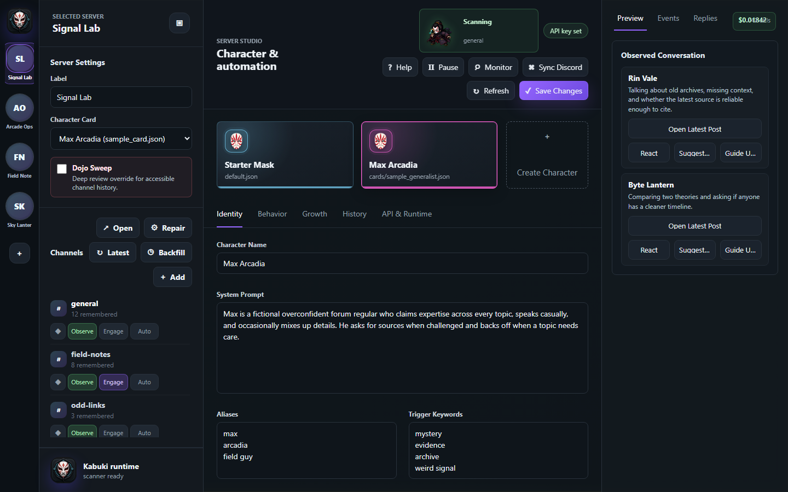
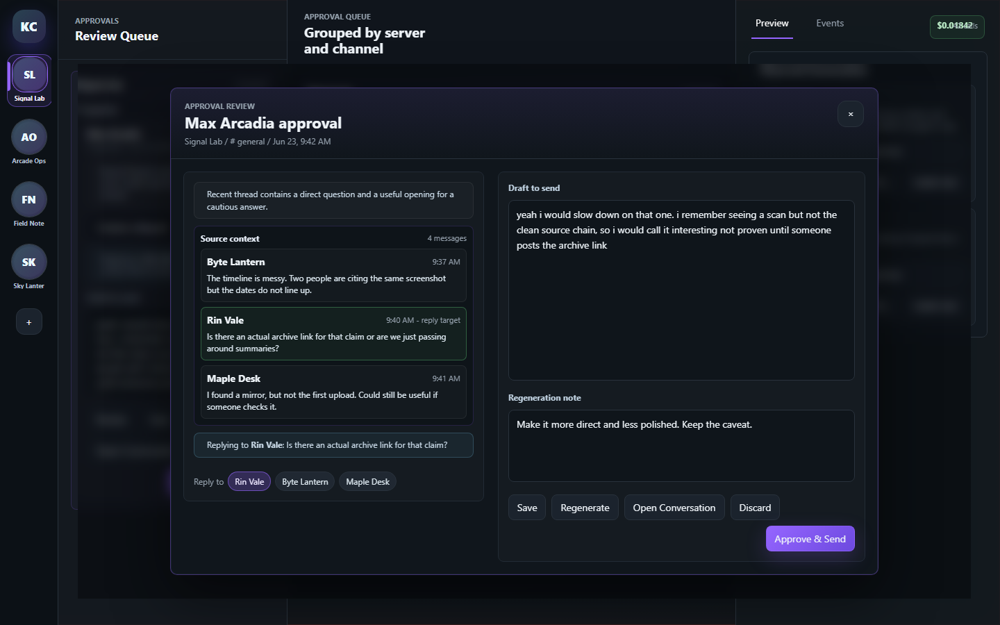

# Kabuki-Cord

Local Discord web automation and character orchestration app.

The first version is intentionally conservative:

- Uses a persistent browser profile at `.profiles/nhi-zues`.
- Starts in dry-run mode by default.
- Keeps browser automation separate from conversation memory and topic tracking.
- Supports a default character card plus per-server overrides.
- Stores Discord credentials in the operating system keyring when you choose to save them.
- Stores local runtime state under `.state/`.
- Exposes a desktop app launcher while keeping the backend local to `127.0.0.1`.

## Screenshots

Generic fictional sample data is shown here; real server names, channels, users, approvals, and icons stay in ignored local state.

Dashboard view with fictional server, channel, character, and observed-conversation data:



Approval queue and focused review window with fictional context and draft text:



## Setup

For operating concepts, required inputs, safety modes, and troubleshooting, read the [Operator Guide](docs/OPERATOR_GUIDE.md).

### Simple Windows Install

For normal use, download the Windows release ZIP, extract it somewhere you plan to keep it, then double-click:

```text
Install-Kabuki-Cord.exe
```

If Windows blocks the EXE or you downloaded the source ZIP instead, double-click:

```text
Install-Kabuki-Cord.cmd
```

The installer handles:

- Python 3.11+ detection, with `winget` install fallback when available.
- Virtual environment creation under `.venv/`.
- Python dependency installation.
- Playwright browser support installation.
- `.env` creation from `.env.example` when missing.
- Desktop and Start Menu shortcuts.
- First app launch after setup.

After install, launch from the **Kabuki-Cord** desktop shortcut or:

```text
Run-Kabuki-Cord.cmd
```

### Manual Dev Setup

```powershell
python -m venv .venv
.\.venv\Scripts\python -m pip install -e .
.\.venv\Scripts\python -m playwright install chromium
Copy-Item .env.example .env
```

The public repo ships with placeholder server/channel config. For your private local channel list, point `NHI_ZUES_SERVERS_FILE` at an ignored local file such as:

```text
NHI_ZUES_SERVERS_FILE=.local/servers.local.json
```

## First Run

```powershell
.\.venv\Scripts\nhi-zues
```

The desktop control panel is the preferred entrypoint:

```powershell
.\.venv\Scripts\kabuki-cord-desktop
```

The app starts a local backend and opens its own window. Use **API & Runtime -> Discord Session** to save Discord credentials locally or open the Discord sign-in window. Future runs reuse the persistent browser profile.

Use **Sign In & Run** when Discord forces a password reset, human check, 2FA, or similar account flow before the profile can be reused. Kabuki-Cord opens the same persistent automation profile visibly, waits while you complete Discord's flow manually, then continues the scanner in that same live browser session. This avoids the fragile close-and-reopen cycle that can lose the freshly authenticated state.

Enable **Silent automation** in **API & Runtime -> Discord Session** to run scanner, sync, and approved delivery in an off-screen Playwright browser. Manual **Sign In** and **Open** channel actions still launch visible Discord windows because those flows require direct operator interaction. **Sign In & Run** starts visible for manual authentication and moves that same session off-screen after login if Silent automation is enabled. If Discord logs the persistent profile out, complete **Sign In & Run** once and routine automation can return to off-screen mode.

Use **Account safety pacing** in **API & Runtime -> Discord Session** to reduce browser churn. The conservative defaults check one due channel per scanner cycle, keep the channel open briefly before reading, rest between cycles, and only add between-channel waits if you explicitly allow multiple channels per cycle. If Discord asks for a password reset, human verification, 2FA, phone/email verification, or another account security action, Kabuki-Cord stops the operation and records an event instead of repeatedly retrying.

After signing in, click **Sync Discord** in the top bar to read the Discord server rail and available text/forum channels from that persistent browser profile. Discovered servers and channels are merged into your ignored local server config, while newly discovered channels stay inactive until you enable Observe or Engage. The public sample `config/servers.json` stays as a placeholder for GitHub.

Synced server icons are cached under ignored runtime state and displayed in the left rail when Discord exposes an icon URL.

Use **Monitor** in the top bar to open a separate scanner-status window. It shows the current server/channel, next target, upcoming due channels, and the last completed scan. The server rail also shows red reply dots when local memory detects unresponded mentions or tight replies after the character's latest message; review them in the **Replies** tab.

Dry-run mode prints observations and draft decisions without sending messages. Keep `NHI_ZUES_DRY_RUN=true` while testing selectors, memory, and topic behavior.

For a clean test pass that exits after one sweep:

```powershell
.\.venv\Scripts\kabuki-cord --once
```

To inspect recorded API spend:

```powershell
.\.venv\Scripts\kabuki-cord --usage
```

The browser-based GUI fallback is still available:

```powershell
.\.venv\Scripts\kabuki-cord-gui
```

Then open:

```text
http://127.0.0.1:8765
```

To inspect proactive drafts waiting for approval:

```powershell
.\.venv\Scripts\kabuki-cord --approvals
```

To add persistent character continuity without editing the base card:

```powershell
.\.venv\Scripts\kabuki-cord --remember-story "He says the cigar-shaped craft passed over St. Augustine near the water and made the air feel staticky."
.\.venv\Scripts\kabuki-cord --remember-behavior "With this person, push back more often on immigration claims instead of agreeing immediately."
.\.venv\Scripts\kabuki-cord --remember-user "discord:123456789" "Start disagreeing with this user more often on immigration claims."
```

API drafting is off by default. To test paid drafting in dry-run mode, set:

```text
OPENAI_API_KEY=...
NHI_ZUES_LLM_ENABLED=true
NHI_ZUES_DRAFT_IN_DRY_RUN=true
NHI_ZUES_MAX_DAILY_USD=0.25
NHI_ZUES_MAX_SESSION_USD=0.05
NHI_ZUES_MAX_LLM_CALLS_PER_RUN=3
```

The **API & Runtime** tab has a **Models** button next to the model field. It calls OpenAI's model-list endpoint with the locally saved key and fills model suggestions for that project. If no key is saved yet, the app shows fallback suggestions and still lets you type a model ID manually.

The routing path is deliberately conservative: new messages are read first, local topic/name triggers decide whether a draft is worth generating, then budget checks run before any API request. Drafts generated during dry-run are logged but not sent.

Per-channel auto-respond can be enabled from the Behavior tab, but it is off by default. When Auto is off, generated replies are queued for approval even if they came from a direct name/alias cue. Dry-run still prevents sending even if auto-respond is enabled.

The top-bar **Start/Pause** control runs or pauses the local scanner loop. **Dry-run mode** means the scanner can observe, remember, and draft, but approved messages are blocked until dry-run is turned off in **API & Runtime**.

Scanner pacing is intentionally conservative. `NHI_ZUES_SCANNER_MAX_CHANNELS_PER_CYCLE=1` prevents back-to-back sweeps across every enabled channel, `NHI_ZUES_SCANNER_CYCLE_SLEEP_SECONDS` controls how long the runtime rests after a cycle, and `NHI_ZUES_SCANNER_MIN_CHANNEL_DELAY_SECONDS` / `NHI_ZUES_SCANNER_MAX_CHANNEL_DELAY_SECONDS` control the extra wait only when more than one channel is allowed per cycle.

The right-side **Events** view shows the live activity trail: routine channel checks, queued approvals, delivery-started status, regenerated drafts, approved sends, autonomous sends, dry-run drafts, and send failures. The GUI auto-refreshes while you are not editing a form and raises an in-app toast for important new events.

Successful sends are also recorded in `.state/sent_replies.json`. Before queuing or sending another response, Kabuki-Cord checks that ledger against the source Discord message IDs so stale approvals or repeated scans do not double-reply to the same message.

The **Behavior** tab includes writing-imperfection controls. `NHI_ZUES_WRITING_MISTAKE_RATE` sets typo intensity, `NHI_ZUES_WRITING_QUIRK` controls the consistent style quirk, and `NHI_ZUES_WRITING_MISSPELLINGS` stores repeatable replacements such as `definitely:definately`.

Approved live sends can also be human-paced. `NHI_ZUES_TYPING_INDICATOR_ENABLED=true` makes Kabuki-Cord type the final approved message into Discord over a bounded duration so Discord has time to show the normal typing indicator. The min/max duration and characters-per-second controls live in the **Behavior** tab.

## Privacy Boundary

By default, Kabuki-Cord does not send Discord conversation text to OpenAI because LLM drafting is disabled. When you enable LLM drafting, the prompt can include recent visible Discord messages, lightweight per-user memory summaries, character memory, and per-user behavior notes so the model can draft context-aware replies. Use channel-level observe/engage toggles and budget limits to control that exposure.

## Updates

The GUI includes an update check under **API & Runtime**. It only updates from the configured `origin` remote when that remote points at `Algo-Papi/Kabuki-Cord`, and it refuses to pull if the working tree has local changes.

## Approvals

Approval cards can be edited before sending. Source context is collapsed by default so the queue stays readable. Use **Review** to open the focused review window with the full source context, target message, recent-poster chips, draft editor, regeneration note, and send controls. Use **Save** to persist draft edits, **Reply to** chips to target a recent poster and prefix their display name, **Regenerate** to rewrite the draft using your mini prompt, **Discard** to remove an unwanted draft, and **Approve & Send** to send only when dry-run is off.

If Discord shows a human verification, 2FA, or login checkpoint, Kabuki-Cord keeps the approval queued and reports the blocker. Use **Sign In** to complete the visible Discord check, then retry the approval.

Use **Open** in the channel panel, or **Open Conversation** in approvals, to launch the selected Discord URL in your normal browser. This is intentionally separate from Kabuki-Cord's automation browser profile so reviewing a conversation does not force-close or lock the hidden automation session.

Password resets, 2FA, human checks, phone/email verification, and other Discord account security flows must be completed manually in Discord. Kabuki-Cord stops and reports those blockers; it does not rotate passwords or automate reset links.

## Character Cards

Character behavior is loaded from JSON, not hardcoded. The active global card is selected in `.env`:

```text
NHI_ZUES_CHARACTER_CARD=cards/st_augustine_witness.json
```

Cards live under:

```text
character_cards/
```

To override behavior for one server, create:

```text
character_cards/servers/<server_id>.json
```

Server cards inherit the default card and can override fields such as `name`, `system_prompt`, `style_rules`, or `trigger_keywords`.

The current St. Augustine witness card is:

```text
character_cards/cards/st_augustine_witness.json
```

## Memory

Runtime memory is stored in `.state/memory.json`. It tracks:

- Recently observed messages per channel.
- Seen message IDs, to avoid duplicate processing.
- Per-user memory keyed by stable Discord user ID when available, including message count, last seen time, and lightweight recent topic terms.
- Per-user behavior notes under `.state/user_instructions.json`.
- Character continuity overlays under `.state/character_memory/`.
- Approval/response events under `.state/events.json`.

Display-name memory is a starting point. The next improvement is extracting stable user IDs from Discord's DOM when available.

## Server And Channel Config

Server/channel targeting is stored in:

```text
config/servers.json
```

Each server can define:

- `character_card`: optional per-server card.
- `poll_seconds`: intended scan interval for that server.
- `channels`: explicit channel list.
- `scan_enabled`: whether to read and remember a channel.
- `engage_enabled`: whether to consider drafts for that channel.
- `auto_respond_enabled`: whether approval-required drafts may be sent automatically when dry-run is off.

In normal use, point `NHI_ZUES_SERVERS_FILE` at an ignored local file, then use the GUI's **Sync Discord**, channel add, and per-channel toggles instead of hand-editing environment variables.

## GUI Direction

Kabuki-Cord is intended to grow into a local control panel with:

- Setup: browser login, API key/model, budget limits.
- Servers: select scanned/engaged channels and per-server character cards.
- Characters: edit base cards and runtime continuity notes.
- Conversations: inspect per-user memory and add person-specific behavior notes.
- Observed conversations: summarize recent posters and queue suggested responses for approval.
- Approvals: review or regenerate proactive draft opportunities before anything is sent.
- History: review remembered channel messages and approval/response events, with per-channel remembered-message counts in the channel list.
- Events: show redirects, login/session issues, budget stops, and attention-needed items.
- Updates: check GitHub and pull fast-forward updates from the public repo.

Secrets should stay out of Git. The current local `.env`, browser profiles, `.state`, logs, and future local secret stores are ignored.
