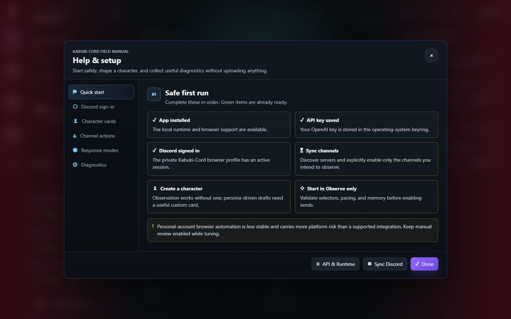
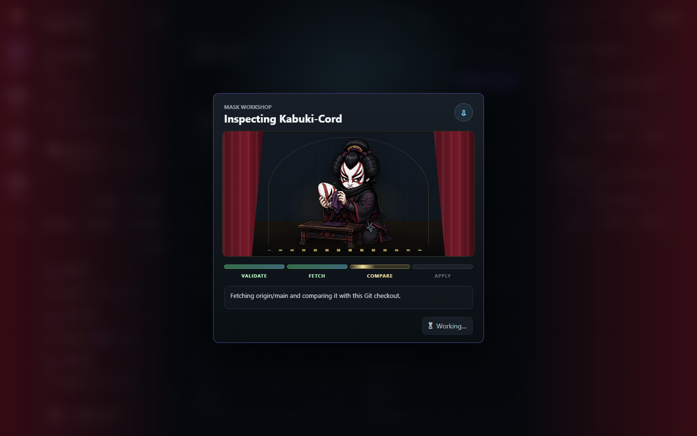

# Kabuki-Cord

Kabuki-Cord is a local Windows control panel for observing Discord channels, maintaining local conversation context, shaping character-driven drafts, reviewing approvals, and pacing browser-based interactions.

> [!WARNING]
> Kabuki-Cord deliberately uses personal-account browser automation instead of Discord's supported bot/gateway integration. That transport is less reliable and carries greater platform and account risk. Start in **Observe only**, keep manual review enabled, and use it only with that tradeoff understood.

**Current release:** [Kabuki-Cord v2.5.0](https://github.com/Algo-Papi/Kabuki-Cord/releases/latest) — Windows, unsigned


All screenshots use deterministic fictional fixtures. Real Discord servers, channels, users, icons, character cards, approvals, and activity remain in ignored local state.

## What V2.5 Includes

- A local desktop control panel bound to `127.0.0.1`.
- A persistent, app-owned Discord browser profile.
- Server and channel discovery through **Sync Discord**.
- Observe, React, Engage, and Auto permissions per channel.
- Four global response modes ranging from observation to autonomous live delivery.
- Character cards with colored Kabuki-mask identities and per-server overrides.
- A review queue with editable drafts, source context, regeneration, reply targeting, and manual delivery.
- Dojo Sweep, Latest, Backfill, Repair, and scanner-monitor workflows.
- Conservative pacing, budget limits, duplicate-response protection, and a single-runtime lock.
- A built-in Help & Setup center.
- Privacy-conscious local diagnostics that are never uploaded automatically.

For detailed operation and field-by-field guidance, read the [Operator Guide](docs/OPERATOR_GUIDE.md).

## Interface

### Help & Setup

The Help center walks through Discord sign-in, API setup, character cards, channel actions, response modes, and local diagnostics.



### Approval Review

Review mode keeps generated replies local until you inspect the source context, edit or regenerate the draft, choose a reply target, and explicitly send it.


### Scanner Monitor

The monitor shows the current and next channel, estimated loop timing, recent responses, reactions, and operation-specific Kabuki animation.


## Windows Installation

### Requirements

- Windows 10 or 11.
- Internet access during installation.
- Python 3.11 or newer. The installer can attempt a `winget` Python installation when needed.
- Roughly **0.8–1.0 GiB** of free space after Python dependencies and Playwright Chromium are installed.

The release ZIP is approximately 23–24 MiB, but it is a bootstrap package rather than a completely self-contained executable.

### Install

1. Open the [latest GitHub release](https://github.com/Algo-Papi/Kabuki-Cord/releases/latest).
2. Download the Windows ZIP and its matching `.sha256` file.
3. Verify the ZIP checksum before running anything.
4. Extract the **entire ZIP** into a folder you plan to keep.
5. Run `Install-Kabuki-Cord.exe` from inside that extracted folder.

The executable is a convenience wrapper around the adjacent installer scripts. Do not run it from inside the ZIP, move it away from the extracted files, or delete the installation folder afterward. The virtual environment and shortcuts continue to use that folder.

If the wrapper is unavailable, run:

```text
Install-Kabuki-Cord.cmd
```

The installer creates the local environment, installs Python dependencies and Playwright Chromium, initializes `%LOCALAPPDATA%\Kabuki-Cord`, creates Desktop and Start Menu shortcuts, and launches the app. Its installation log is written to:

```text
%LOCALAPPDATA%\Kabuki-Cord\state\install.log
```

### Unsigned Release Notice

V2.5.0 is not Authenticode-signed. Windows SmartScreen or antivirus software may warn, quarantine the wrapper executable, or remove it from a downloaded ZIP.

Verify the release checksum against the accompanying `.sha256` file before restoring or allowing anything. Do not disable antivirus globally; if a trusted, checksum-matching build needs an exception, limit it to the specific extracted Kabuki-Cord folder or executable.

## Safe First Run

1. Launch **Kabuki-Cord** from the Desktop or Start Menu shortcut.
2. Open **Help** and follow the Quick Start checklist.
3. Under **API & Runtime → Discord Session**, click **Sign In** and complete login, CAPTCHA, passkey, or 2FA yourself in the visible Discord window.
4. Click **Sync Discord**, then explicitly enable only the channels you intend to observe.
5. Add an OpenAI API key only if you want model-generated drafts. The key is stored in the operating-system keyring.
6. Create a character card for persona-driven drafting. Observation, Latest, Backfill, Repair, Sync, and local history do not require one.
7. Keep the global mode on **Observe only** while checking selectors, pacing, local memory, and channel scope.
8. Move to **Review every draft** only after observation behaves as expected.

Use **Switch Account** before signing into a different Discord account. It clears only Kabuki-Cord's app-owned Discord session and saved Discord credentials; local history remains. After the new login, sync again and explicitly re-enable the intended channels.

## Response Modes

| Mode | Behavior | Recommended use |
| --- | --- | --- |
| **Observe only** | Reads and remembers permitted channels but never sends. Optional draft previews can still use API budget. | Setup, discovery, and regression testing. |
| **Review every draft** | Eligible replies enter the approval queue and require an explicit send. | Default while tuning a character. |
| **Limited autonomous** | Regular eligible replies may send automatically; proactive and manual drafts still require review. | After consistently good review results. |
| **Autonomous live** | Eligible replies may send when channel permissions, budgets, pacing, and safety guards all pass. | Highest-risk mode; monitor continuously. |

The global mode combines with each channel's **Observe**, **Engage**, and **Auto** switches. Enabling a channel switch does not bypass the global mode, budgets, cooldowns, duplicate guards, or dry-run restrictions.

## Character Cards

Character behavior comes from local JSON rather than hardcoded personas. New installations receive only a neutral starter template. The public repository and release archives do not include operator-created cards or server-specific instructions.

Local cards live under:

```text
%LOCALAPPDATA%\Kabuki-Cord\character_cards\
```

The selected global card is stored as a non-secret setting. A server-specific override can be placed at:

```text
character_cards\servers\<server_id>.json
```

The Help center explains how to use identity, system prompt, aliases, trigger keywords, style rules, engagement rules, growth notes, and user-specific guidance without conflating those responsibilities.

## Privacy and Local Data

Kabuki-Cord keeps its normal runtime data under:

```text
%LOCALAPPDATA%\Kabuki-Cord\
```

That directory contains the app-owned Discord browser profile, ignored server configuration, character cards, settings, SQLite state, JSON recovery mirrors, logs, and diagnostics.

- OpenAI and optional Discord credentials are stored through the operating-system keyring. Environment variables remain an advanced fallback.
- Non-secret GUI settings are stored in `settings.env`; secret keys are explicitly rejected from that file.
- The local GUI binds to loopback only and protects local API calls with a per-process token.
- LLM drafting is disabled by default. With it disabled, Discord conversation text is not sent to OpenAI.
- When LLM drafting is enabled, selected recent Discord context, character memory, and scoped user guidance may be sent to OpenAI to create a draft.
- Local cards, settings, browser profiles, runtime databases, logs, Discord identifiers, and operator state are ignored by Git and excluded from release archives by automated checks.

Always inspect what you observe and which features you enable. Automated packaging safeguards reduce accidental disclosure risk, but they are not a substitute for reviewing a release.

## Diagnostics

Open **Help → Diagnostics → Collect Logs & Open Folder** to create a local support bundle at:

```text
%LOCALAPPDATA%\Kabuki-Cord\diagnostics\
```

The bundle contains the app version, platform details, content-free activity metrics, configuration counts, and redacted warning/error logs. It excludes chat text, character cards, credentials, API keys, event memory, and the Discord browser profile. Nothing is uploaded or sent; you decide whether to share the ZIP.

## Updates

The Mask Workshop provides visual progress and result states for the in-app update check:



The current updater is intentionally conservative but has an important limitation: it works **only when Kabuki-Cord is running from a real Git checkout**. It validates the configured `origin`, refuses dirty or diverged trees, fetches `origin/main`, and applies only a fast-forward pull.

The normal Windows release ZIP does not contain `.git`, so installed release users must download and install newer GitHub releases manually. The current updater is not yet a release-artifact installer and does not automatically reinstall changed dependencies after a source pull.

## Development Setup

```powershell
git clone https://github.com/Algo-Papi/Kabuki-Cord.git
cd Kabuki-Cord
python -m venv .venv
.\.venv\Scripts\python -m pip install -e ".[dev]"
.\.venv\Scripts\python -m playwright install chromium
.\.venv\Scripts\kabuki-cord-desktop
```

Useful commands:

```powershell
# One scanner sweep, then exit
.\.venv\Scripts\kabuki-cord --once

# Inspect recorded API usage
.\.venv\Scripts\kabuki-cord --usage

# List pending approvals
.\.venv\Scripts\kabuki-cord --approvals

# Browser-hosted GUI fallback
.\.venv\Scripts\kabuki-cord-gui
```

For isolated testing, set `KABUKI_CORD_DATA_DIR` to a temporary directory so development fixtures never touch your normal local profile:

```powershell
$env:KABUKI_CORD_DATA_DIR = "C:\path\to\temporary\kabuki-data"
```

## Repository Guides

- [Operator Guide](docs/OPERATOR_GUIDE.md)
- [V2 Architecture](docs/V2_ARCHITECTURE.md)
- [Release Process](docs/RELEASING.md)
- [Security Policy](SECURITY.md)

## Project Status

Kabuki-Cord V2.5 is usable but remains dependent on Discord's changing web interface and on personal-account browser automation. Selectors, login flows, and platform behavior can change without notice. Keep backups of local cards and instructions, begin conservatively, and treat unattended operation as an explicit risk decision.
